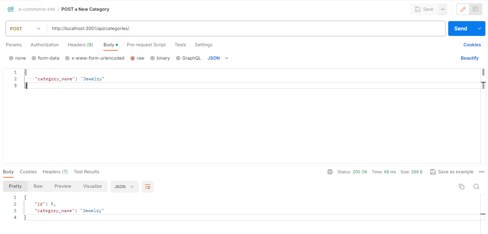

# E-commerce Backend

## License

This project is licensed under the [MIT License] - see [LICENSE](LICENSE) file for more details.

## Description

A backend system, tailored for e-commerce, leverages Express.js and Sequelize to create, populate, and synchronize development databases. Users can seamlessly interact with the system through GET, POST, PUT, and DELETE routes, enabling efficient data retrieval and manipulation within their database.

## Table of Contents

- [License](#license)
- [Description](#description)
- [Demonstration](#demonstration)
- [Screenshots](#screenshots)
- [Installation](#installation)
- [Usage](#usage)
- [Technologies](#technologies)
- [Questions](#questions)

## Demonstration

### Sourcing Schema, Seeding DB, and Running POSTMAN

[Link to Demonstration video](https://clipchamp.com/watch/Q7vx72U2gRV)

## Screenshots

### POSTMAN ROUTE TESTING

## Installation

1. Fork or Clone my repository to your local machine.
2. Open the forked or cloned repository in VSCode or your preferred code editor.
3. Open the integrated terminal for the document and install all dependencies using command: 

`npm i`

## Usage

### Run application:

1. Log in to your mySQL shell
2. Run the schema by using command `source ./db/schema;` in your terminal.
3. Close your mySQL shell with command `exit`. 
4. Populate database by running seed files with command, `npm run seed`.
5. Start the server with command `node server.js`
6. Use Postman or a similar technology to Get, Post, Put, and Delete different Categories, Products, and Tags.

## Technologies

### MySql2 [Version 3.6.5](https://www.npmjs.com/package/mysql2)

### Sequelize [Version 5.21.7](https://sequelize.org/)

### POSTMAN (https://www.postman.com/downloads/)

### Nodemon [Version 2.0.3](https://www.npmjs.com/package/nodemon)

### Dotenv [Version 8.2.0](https://www.npmjs.com/package/dotenv)

## Questions

[Follow me on Github!](https://github.com/Dossman-thomas)

Have any further questions? Feel free to reach me via tdossman.development@gmail.com
